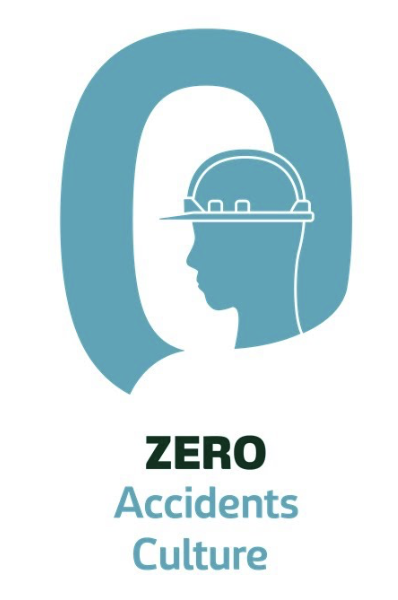
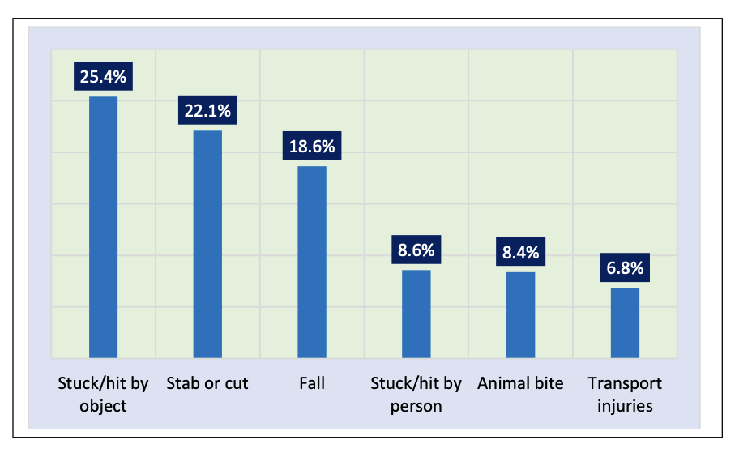
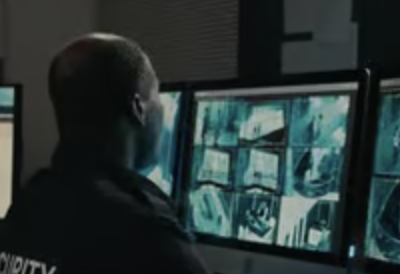
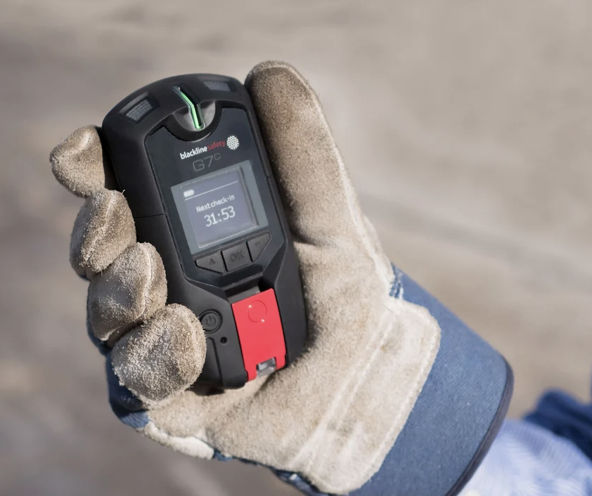
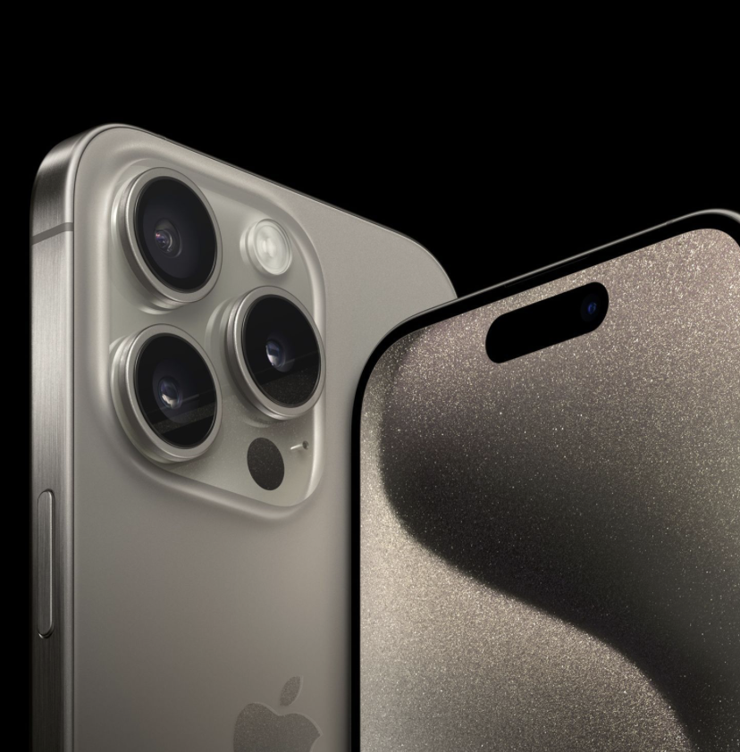

# **EDP23[draft]- A Workspace Accident Detection and Reporting System Aimed at Archieving a Zero-Accident Workplace**

---

## 1. **Motive: Workplace Accidents?**

- Accidents do happen in workpaces, especially in the manual labor sector.
    - [In **Sri Lanka**, approximately **2,000** non-fatal occupational accidents occur annually, while the number of fatal accidents ranges between **60** and **80**.](https://labourmin.gov.lk/approximately-two-thousand-non-fatal-workplace-accidents-occur-annually-deputy-minister-of-labour-mahinda-jayasinghe/)  
    - [In **2023**, the **USA** experienced **226,698** preventable deaths and **62 million** injuries.](https://injuryfacts.nsc.org)  
    - [In **France**, there are **2 deaths daily** and **600,000 injuries** due to workplace accidents.](https://www.radiofrance.fr/franceinter/accidents-du-travail-en-france-cinq-chiffres-a-retenir-2759756)  
- Most accidents happen due to **human error**, but some occur due to **technical issues and cost-cutting measures**. Despite this, many companies and countries aim for **"zero accidents."**   

- Here is quick list of some recents workspace accidents happened in **Sri Lanka**.
    1. [5 deaths due to Ammonia gas poisoning in a rubber factory in Horana.](https://www.business-humanrights.org/en/latest-news/sri-lanka-authorities-to-investigate-horana-rubber-factory-incident-over-alleged-violations-of-workplace-safety-resulting-in-deaths-injuries/)
    2. [Sri Lankan sewage maintenance workers killed due to lack of basic safety measure.](https://www.wsws.org/en/articles/2023/04/10/gllj-a10.html)
    3. [A study that goes about high tension electric trauma at workplaces in Sri Lanka.](https://www.researchgate.net/publication/351857738_High_tension_electric_trauma_at_workplaces_in_Sri_Lanka/fulltext/60ada0c6299bf13438e83662/High-tension-electric-trauma-at-workplaces-in-Sri-Lanka.pdf)
    4. [Missing Dematagoda railway employee found dead in well.](https://www.hirunews.lk/english/377994/missing-dematagoda-railway-employee-found-dead-in-well)
    5. [Electrocuted construction worker falls to his death.](https://www.sundaytimes.lk/150913/news/electrocuted-construction-worker-falls-to-his-death-164048.html)
    6. And many more unfortunately like [workplace](https://www.google.com/url?sa=t&source=web&rct=j&opi=89978449&url=https://www.ifc.org/en/pressroom/2022/workplace-violence-and-harassment-costs-sri-lankan-businesses-millions-ifc-study&ved=2ahUKEwj48J3yj4-MAxWsV2wGHRuzNa0QFnoECCgQAQ&usg=AOvVaw1ablS2chmVXsafVO8FgBjM) [violence]((https://www.google.com/url?sa=t&source=web&rct=j&opi=89978449&url=http://www.osha.gov/workplace-violence&ved=2ahUKEwi5t6P9jo-MAxWmUGwGHdcuKYcQFnoECCYQAQ&usg=AOvVaw37eqJl145t49QgxazNltBU)), etc.

---

## 2. **Types of Workplace Accidents?**

- What kind of accidents could happen in workplaces? Do they depend on the type of work being done?
    - Leading workspace-related injuries in **Sri Lanka**, according to the [Directorate of Non-Communicable Diseases](https://www.ncd.health.gov.lk/images/injury/Annual_injury_report_2022.pdf), are as follows:  

    - The most common accident in the **construction sector** in **Sri Lanka** is **falling** followed by **being struck-by something**, acording to both [paper 1](https://www.irbnet.de/daten/iconda/CIB_DC31500.pdf), and [paper 2](https://pdfs.semanticscholar.org/4db1/fe19e3a5042d9ae9aeff6af24bbe6ea245b0.pdf).

    - According to [**American Insurance**](https://www.americaninsuranceid.com/blog/2018/07/top-10-causes-of-workplace-injuries), the three most common accidents are:  
      1. Overexertion involving external sources.  
      2. Falling.  
      3. Being struck by an object.
      4. Exposure to hazardous substances.
  
    - According to [**Makrosafe**](https://www.makrosafe.co.za/blog/Top-10-Most-Common-Injuries-On-Duty?cat=Security%20Industry), the top causes are:  
      1. Repetitive motion injury.  
      2. Slips, trips, and falls.  
      3. Workplace violence.  
      4. Vehicle accidents.
  
    - **[OSHA](https://www.oshaoutreachcourses.com/blog/fatal-four-osha/) (Occupational Safety and Health Administration)** Fatal Four: Most prominent accidents in construction:
      - Fall (36%)
      - Struck-by (10%)
      - Caught-in/between (9%)
      - Electrocution (2%)

---

## 3. **Prevention or Response?**

Some workplace accidents are **preventable**, while others require a **rapid response** to minimize harm. Unfortunately, many incidents go **unnoticed** and **unattended**, leading to unnecessary loss of life.  

Should anyone lose their life while working? **Absolutely not.**  
That's why we must focus on both **prevention** and **rapid action** to ensure workplace safety.

---

## 4. **Proposed Solution?**

Introducing **______________** , a compact wearable **device** designed to:

### 4.1. **Accident Detection & Reporting**
   

- **Early Detection (Manual/Automatic) to Base Station:**
    - Report **workspace violence** with a **discreet button press**.
    - Monitor **live location** using **GPS**.
    - Geofencing using **GPS**.
    - 'No-motion for a long-time' detection, and ask for a confirmation from the worker through the device's simple UI.
    - (*optional) Detect **live wires** using an **induction sensor**. (e.g., [**High tension lines**](https://www.researchgate.net/publication/351857738_High_tension_electric_trauma_at_workplaces_in_Sri_Lanka/fulltext/60ada0c6299bf13438e83662/High-tension-electric-trauma-at-workplaces-in-Sri-Lanka.pdf))
    - (*optional) Detect **toxic gases** that are otherwise unnoticed (e.g., [**CO**](https://www.wsws.org/en/articles/2023/04/10/gllj-a10.html), [**Ammonia**](https://www.business-humanrights.org/en/latest-news/sri-lanka-authorities-to-investigate-horana-rubber-factory-incident-over-alleged-violations-of-workplace-safety-resulting-in-deaths-injuries/), [**H2S**]((https://www.wsws.org/en/articles/2023/04/10/gllj-a10.html))).

- **Automated Reporting Post-Accident:**  
    - **Falling/Unconsciousness** detection using **IMU sensors**.
    - **Struck by an object (e.g., vehicle impact)** using the same **IMU sensors**.
    - **Loud scream detection** using a **microphone**.
    - (*optional) **Drowning detection**.

---

   [*] *The exact configuration of the sensor array for a particular device is decided at the **point of purchase**, as it is costly, and not all sensors may be beneficial for every user, industry, or work setting.*

### 4.2. **User Interface (UI)**

- **Worker Side:** Minimalist, **screen-less** UI with a **single push button**.
- **Monitoring/Base Station:** Software that **reports/alarms** for potential or actual accidents for every employee using the device.
- **Device Features:**
    - Small, **wearable** (attachable to a **belt/helmet/etc.**)
    - Runs on **battery**, for a considerably long time without recharging/replacing.
    - **Customizable configuration** based on industry needs. *(E.g., fall detection is included in every configuration, gas detection is an optional add-on.)*

---

*Todo: Design a website snapshot to guide users through configuration...*

---

## 5. **Market Analysis**

- **Existing Solutions:** Some devices and services already provide similar functionalities, proving that this is not an abstract concept.
  
- **Why This Over Others?**
    - **Cost:**
        - Most competitors exceed [**$500**](https://loneworkerdevices.com/buy-now/) and often require a [**subscription**](https://www.okaloneworker.com/pricing/our-plans/) (which alone can exceed a manual worker's salary in **Sri Lanka**).
        - **Safety should be accessible** for **everyone**, from individual workers to employees in large corporations.
    - **Flexible Deployment:**
        - Can be used with a **base station for businesses** or as a **standalone device** communicating with a **loved one's phone**.
    - **Compared to [Smartphones](https://sheqsy.com):**
        1. While smartphones offer some similar functions, many features require **subscriptions** and are **limited by hardware capabilities**.
        2. **Better battery life** - no one wants a dead battery in an emergency.
        3. **Simple, foolproof UI** - emergencies require quick, effortless actions.
        4. **Specialized hardware** - smartphones lack **gas sensors** and other critical features.

## 6. **Target Users? Other Possibilities?**

  1. **Individual workers** (e.g., **drivers, local construction workers**).
  2. **Large corporations**.
  3. [**Elderly individuals**](https://doi.org/10.1109/CCWC.2017.7868363) who may stay home alone unattended.
  4. **Adventurers** (e.g., [**bikers**](https://livall.com/collections/all-product), **hikers, campers**) who may face risks in remote areas.

---

## 7. **Implementation [Draft]**

### 7.1. The wearable device:
1. A low powered **microcontroller** polls sensory data.
2. In case of an event, it uses **GSM/GPS communication** to alert the base station and vice versa.

### 7.2. The base station:
1. Connects to a PC or a security system using USB.
2. Uses a microcontroller and GSM/GPS communication.
3. For individual workers the base station is simply replaced with an simple mobile app (or a text messages based implementation) on some other party's cellcular device(e.g., a loved one).

---

## 8. **Hardware & Cost Estimation [Draft]**

| Component               | Cost (LKR)  |
|-------------------------|-------------|
| **LP Microcontroller x2**| TBD     |
| **GSM Module x2**        | ~1150 x2    |
| **Small Buzzer**         | ~90         |
| **Enclosure**            | TBD         |
| **PCB**                  | TBD         |
| **IMU Sensor** (Mandatory) | ~650       |
| **Microphone** (Mandatory) | ~160       |
| **Gas Sensors** (Optional) | ~900      |
| **Other Optional Sensors** | TBD      |
| **Push Button**          | ~100  |

---

## 9. **Next Steps [Draft]**

- **Refine the implementation** and **expand UI details**.
- **Develop a prototype**.
- **Develop a GUI for base station**.
- **Gather user feedback** for iterative improvements.

---

## **10. References**

- **Competitors:**
    1. [Black Line Safety](https://www.blacklinesafety.com/solutions/lone-worker/g7-lone-worker)
    2. [Solo Protect](https://www.soloprotect.com)
    3. [People Safe](https://peoplesafe.co.uk/safety-devices/)

- **Data Local:**
    1. [Occupational injuries in Sri Lanka](https://www.ncd.health.gov.lk/images/injury/Annual_injury_report_2022.pdf) [Pages 77-83]
    2. [Poor Occupational Safety in Sri Lanka - a study](https://iopscience.iop.org/article/10.1088/1755-1315/1101/4/042038/pdf)
    3. [Workplace accidents in Sri Lanka - Ticking time bomb](https://www.sundaytimes.lk/180506/business-times/workplace-accidents-ticking-time-bomb-292906.html)
    4. [Ammonia gas poisoning in Horana](https://www.business-humanrights.org/en/latest-news/sri-lanka-authorities-to-investigate-horana-rubber-factory-incident-over-alleged-violations-of-workplace-safety-resulting-in-deaths-injuries/)
    5. [Two deaths from lack of safety measures in Sri Lanka](https://www.wsws.org/en/articles/2023/04/10/gllj-a10.html)
    6. [Ministry of Labor Sri Lanka](https://labourmin.gov.lk/approximately-two-thousand-non-fatal-workplace-accidents-occur-annually-deputy-minister-of-labour-mahinda-jayasinghe/)
    7. [National Occupational Safety Policy Sri Lanka](http://www.eohfs.health.gov.lk/occupational/images/pdf/National-occupational-safety-and-health-policy-of-Sri-Lanka.pdf)
    8. [Workspace Accidents in Sri Lanka](https://www.irbnet.de/daten/iconda/CIB_DC31500.pdf)
    9. [Construction accidents Sri Lanka](https://pdfs.semanticscholar.org/4db1/fe19e3a5042d9ae9aeff6af24bbe6ea245b0.pdf)
    10. [Workspace violence in Sri Lanka](https://www.ifc.org/en/pressroom/2022/workplace-violence-and-harassment-costs-sri-lankan-businesses-millions-ifc-study)
    11. [Sri Lankan sewage maintenance workers killed](https://www.wsws.org/en/articles/2023/04/10/gllj-a10.html)
    12. [High tension electric trauma in Sri Lanka](https://www.researchgate.net/publication/351857738_High_tension_electric_trauma_at_workplaces_in_Sri_Lanka/fulltext/60ada0c6299bf13438e83662/High-tension-electric-trauma-at-workplaces-in-Sri-Lanka.pdf)
    13. [Missing Dematagoda railway employee found dead](https://www.hirunews.lk/english/377994/missing-dematagoda-railway-employee-found-dead-in-well)
    14. [Electrocuted construction worker falls to his death](https://www.sundaytimes.lk/150913/news/electrocuted-construction-worker-falls-to-his-death-164048.html)
    15. [Workplace violence and harassment costs Sri Lankan businesses millions](https://www.ifc.org/en/pressroom/2022/workplace-violence-and-harassment-costs-sri-lankan-businesses-millions-ifc-study)

- **Data Global:**
    1. [NSC - National Safety Council USA](https://injuryfacts.nsc.org)
    2. [RADIOFRANCE - Workplace accidents in France](https://www.radiofrance.fr/franceinter/accidents-du-travail-en-france-cinq-chiffres-a-retenir-2759756)
    3. [AMERICANINSURANCE - Causes of workplace injuries](https://www.americaninsuranceid.com/blog/2018/07/top-10-causes-of-workplace-injuries)
    4. [OSHA - Fatal Four in construction](https://www.oshaoutreachcourses.com/blog/fatal-four-osha/)
    5. [OSHA - Workplace violence](http://www.osha.gov/workplace-violence)

- **Similar Ideas:**
    1. [Smart Helmet for adventurers](https://livall.com/collections/all-product)
    2. [Fall Detection for Elderly](https://doi.org/10.1109/CCWC.2017.7868363)
    3. [Lone Worker Safety Devices](https://www.okaloneworker.com/pricing/our-plans/)
